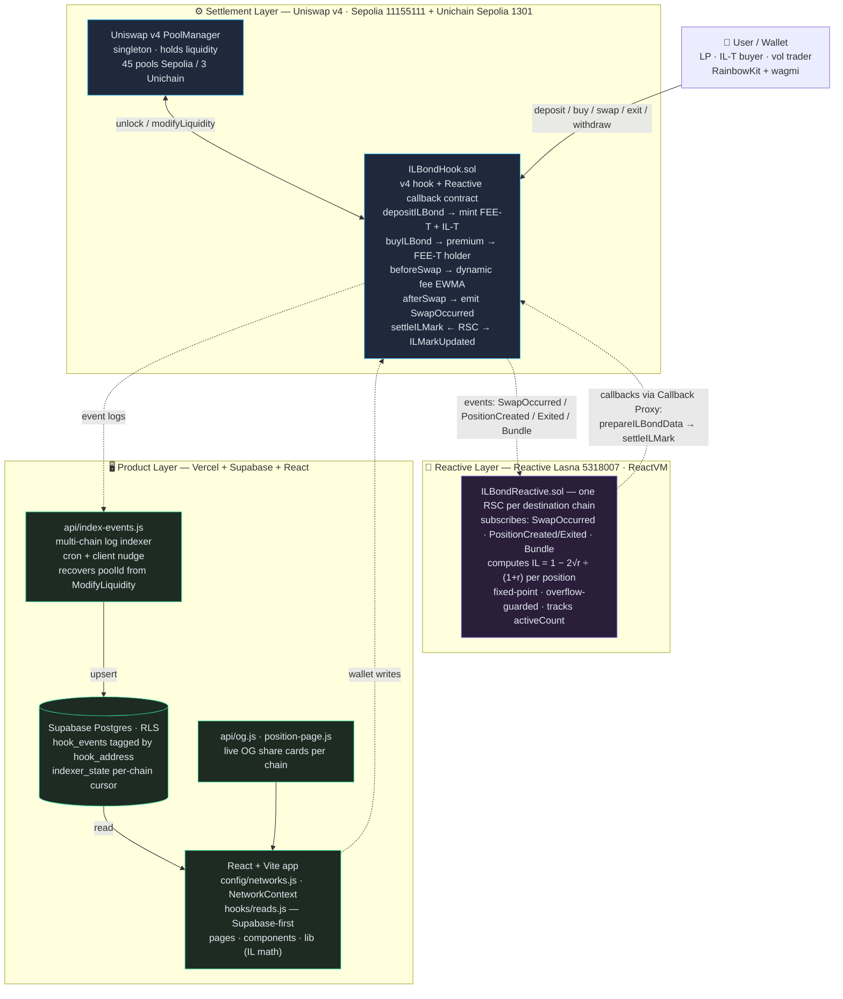
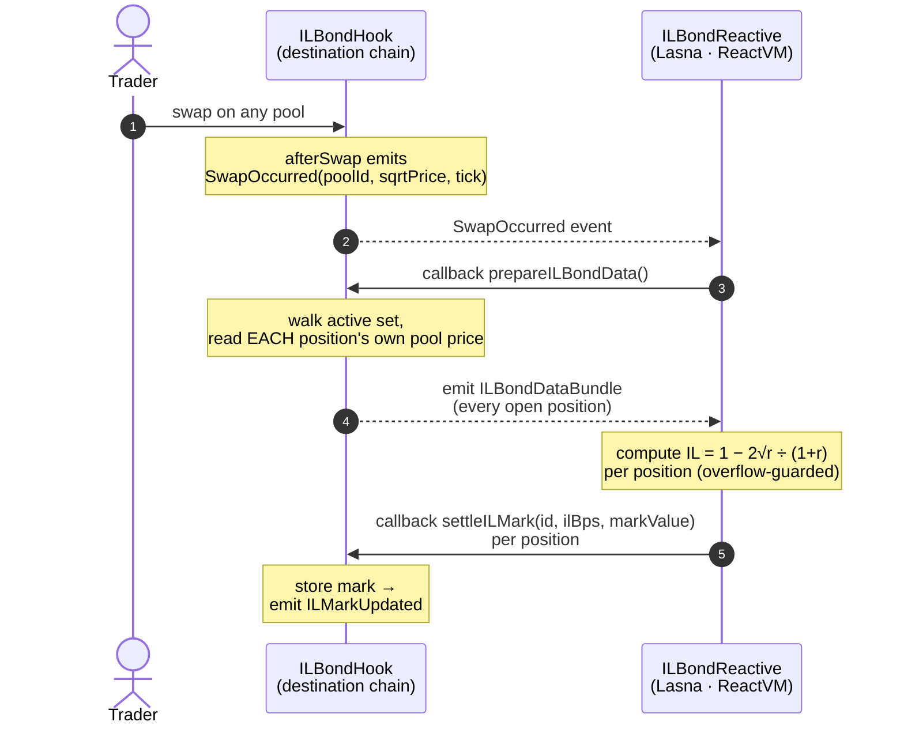

# schizō — Impermanent loss, unbundled

**A Uniswap v4 hook that splits every LP position into a yield leg (FEE-T) and a risk leg (IL-T) — with the impermanent-loss mark recomputed on every swap by a Reactive Smart Contract, no keeper and no cron.**

Live app → https://schizo-il-bond.vercel.app · Built for UHI9 (Theme: Impermanent Loss) · Uniswap v4 + Reactive Network

> **This repository is a fork of the Uniswap [`v4-template`](https://github.com/uniswapfoundation/v4-template)** — the official scaffolding for designing and building Uniswap v4 hooks. We used it as the foundation (PoolManager / PositionManager wiring, `HookMiner` salt-mining, and the Foundry test harness) and built the entire ILBondHook system on top of it.

---

## 1. About the project

### What we do

A Uniswap LP position is really two unrelated exposures stapled together:

- **Fee income** — steady, vol-positive, grows with trading volume.
- **Impermanent loss** — vol-negative, the bill you pay whenever the price moves.

Nobody asked for them bundled. A DAO treasury that wants yield doesn't want the price risk; a trader who wants to bet on volatility doesn't want to babysit a position. Uniswap hands everyone the same package anyway.

**schizō unbundles the position at deposit time into two transferable claims on the same liquidity:**

| Leg | What it holds | Who wants it |
|-----|---------------|--------------|
| **FEE-T** | swap fees **+** an upfront premium · **zero price risk** | yield seekers, treasuries |
| **IL-T** | the impermanent-loss P&L (for or against) · pays the premium | volatility traders, speculators |

Hold both legs → you're a normal LP. Sell **IL-T** → you earn yield with the risk handed off. Sell **FEE-T** → you hold a pure, leveraged bet on volatility. One deposit, two instruments, two audiences. **IL stops being a tax and becomes something you can price, buy, and sell.**

### Why it's unique

- **Everyone else *reduces* IL — we *separate* it.** Dynamic-fee hooks, rebalancing, insurance pools, and LVR auctions all keep the LP holding the risk and try to soften it. schizō cuts the position in half and lets the two halves trade independently. That's the difference between *tranching a bond* and *inventing the credit-default swap*.
- **Not a derivative — a slice of the position itself.** Options-on-LP write a contract *next to* a position. IL-T **is** the position's downside leg, settled from the real underlying on exit.
- **Fully bilateral — no capital pool.** Insurance hooks need a float to pay claims. schizō needs nothing but a willing counterparty and an upfront premium.
- **The risk leg is kept honest autonomously.** IL is a function of price, and price only moves on swaps — so the mark must update on every swap, per position, against its own entry price. A **Reactive Smart Contract** does exactly that, with no off-chain bot to trust and no timer burning gas. This product does not exist without it.
- **Genuinely dynamic fees.** Each pool charges `0.30% + f(realized volatility)`, capped at 3%, driven by an on-chain EWMA of tick movement — verified climbing under load and decaying when calm. (Most "dynamic fee" demos ship a constant in disguise.)

### Partner integrations

schizō was built to qualify across **all three** tracks at once — each is load-bearing, not bolted on:

| Track | How schizō integrates it | Why it qualifies |
|-------|--------------------------|------------------|
| **Open track** | A novel Uniswap **v4 hook** that addresses the IL theme by *tranching* the position (FEE-T / IL-T) rather than reducing IL — with real dynamic fees in `beforeSwap`, real full-range liquidity minted via `unlock`/`modifyLiquidity`, and 74 passing Foundry tests. | A complete, original v4-hook product end to end: contracts → indexer → production app. |
| **Unichain** | The **entire system is deployed independently on Unichain Sepolia (1301)** — its own ILBondHook, its own Reactive contract, fresh mock tokens, its own pools and positions. The frontend's per-chain registry (`config/networks.js`) reconfigures every address/token/pool/explorer from the connected wallet's chain, and the backend indexer is multi-chain (per-chain cursor, rows isolated by `hook_address`). | Proves portability: a second, fully self-contained deployment that never touches the Sepolia one, live and marking on Unichain. |
| **Reactive Network** | The IL mark is computed by a **Reactive Smart Contract** on Lasna that subscribes to the hook's swap events and runs the two-phase relay `prepareILBondData → ILBondDataBundle → settleILMark` in the ReactVM — one RSC per destination chain. | The RSC is the *brain* of the product, not a side feature — the IL leg cannot be kept honest on every swap, trustlessly and off the hot path, without it. |

---

## 2. Architecture

Three layers — **settlement** (Uniswap v4), **brains** (Reactive Network), **product** (backend + frontend) — wired into one event loop. The same contract pair is deployed independently on two destination chains; everything in the app resolves by the connected wallet's chain.



**The hot path stays cheap.** `afterSwap` does nothing but emit a price snapshot. All the expensive work — decoding every open position and running the IL formula — happens in the ReactVM, where it's nearly free and externally auditable. The mark moves exactly when reality moves, which is the only time it should.

**The frontend reads backend-first.** Public RPCs cap `eth_getLogs` to ~9,500 blocks (~hours of history). The Supabase indexer ingests the *full* hook-event history per chain, so price charts, IL marks, activity feeds, leaderboards and pool trends are complete and fast; on-chain log reads are only a fallback.

### The reactive loop



**Exit & settle (separate user action).** Any party (LP / FEE-T / IL-T holder) can `exitPosition`: liquidity is removed and the underlying is credited to the **IL-T holder** — they bear the position's composition, which *is* the impermanent loss — then each party `withdraw`s their own balance per token. No timer anywhere; the mark updates exactly when price does.

---

## 3. What is where, and how to run it

### Repository layout

```
src/
  ILBondHook.sol          # v4 hook + Reactive callback contract (runs on Sepolia / Unichain)
  ILBondReactive.sol      # the Reactive Smart Contract (runs on Lasna ReactVM)
  MockERC20.sol           # mintable test token (in-app faucet)
test/                     # 74 Foundry tests — unit, fuzz, invariant
  ILBondHook.t.sol        # lifecycle, access control, dynamic fee, multi-pool, fuzz   (27)
  ILBondHookEdge.t.sol    # refunds, premium routing, exit auth, active-set, events    (14)
  ILReactiveMath.t.sol    # IL math fuzzed over full sqrt-price range + react() path   (10)
  ILReactiveLifecycle.t.sol # react() routing, callback-only access, activeCount       (11)
  ILBondHookInvariant.t.sol # solvency / active-set / fee-bound invariants
script/
  25_FreshDeploy.s.sol        # Sepolia: hook + 45 pools, seeded
  30_UnichainDeploy.s.sol     # Unichain: hook + 3 mock tokens + pools + 2 positions
  31_UnichainSwaps.s.sol      # Unichain: price-moving swaps
frontend/                 # React + Vite app
  src/config/networks.js      # per-chain deployment registry (the source of truth)
  src/hooks/reads.js          # all contract/data reads (Supabase-first, chain fallback)
  src/lib/                    # IL math, liquidity, quoting, formatting, supabase client
  src/pages/ , src/components/  # the UI
  api/index-events.js         # multi-chain Supabase event indexer (cron + client nudge)
  api/og.js , api/position-page.js  # live share cards per chain
  supabase/schema.sql         # the hook_events + indexer_state tables (run once)
  vercel.json                 # routes + the daily indexer cron
ILBOND_PITCH.md           # the pitch
ILBOND_REPORT.md          # full technical report
```


### Prerequisites

- [Foundry](https://book.getfoundry.sh/) (`forge`, `cast`) · Node 18+ · npm
- A funded testnet key for deploying/swapping (Sepolia ETH, Unichain Sepolia ETH, Lasna REACT)

### Contracts — build & test

```bash
forge install
forge build
forge test            # 74 passing: unit + fuzz + invariant
```

### Frontend — run locally

```bash
cd frontend
npm install
npm run dev           # Vite dev server; reads on-chain directly
```

The app works against the **live** deployments out of the box. The Supabase indexer and OG cards run as Vercel functions — to exercise them locally use `vercel dev`, or just deploy. Environment variables (frontend reads `VITE_`-prefixed; the indexer reads server-only keys):

```
VITE_SUPABASE_URL=...              # public, read-only client
VITE_SUPABASE_PUBLISHABLE_KEY=...
SUPABASE_URL=...                   # server-side (indexer)
SUPABASE_SERVICE_ROLE_KEY=...      # server-side ONLY — never shipped to the client
VITE_SEPOLIA_RPC= / VITE_UNICHAIN_RPC= / VITE_LOG_RPC=   # optional RPC overrides
```

Backend setup: run `frontend/supabase/schema.sql` once in the Supabase SQL editor (creates `hook_events` + `indexer_state` with RLS — public read, indexer writes with the service-role key). The indexer is multi-chain: each chain has its own entry in `api/index-events.js NETWORKS` and its own resume cursor, and rows isolate by `hook_address`.

### Live deployments

| | Ethereum Sepolia (11155111) | Unichain Sepolia (1301) |
|---|---|---|
| ILBondHook | `0x58A3A816864F1E5f6F38F01f9f5AE1Cacc9210C0` | `0x56B99A42E41D5987b2F39E97F3EBe5f3d76e10C0` |
| ILBondReactive (Lasna) | `0x27eab090BF647e191A4FB121A780aA6ED89C53E2` | `0x4F193c807b4BD93054332bc67e64428725AA107D` |
| PoolManager | `0xE03A1074c86CFeDd5C142C4F04F1a1536e203543` | `0x00B036B58a818B1BC34d502D3fE730Db729e62AC` |
| Callback proxy | `0xc9f36411C9897e7F959D99ffca2a0Ba7ee0D7bDA` | `0x9299472A6399Fd1027ebF067571Eb3e3D7837FC4` |
| Pools | 45 pairs (10 tokens) | 3 pairs (mWETH/mWBTC/mUSDC) |

### Deploy your own

```bash
# Sepolia (45 pools, seeded)
forge script script/25_FreshDeploy.s.sol --rpc-url <SEPOLIA_RPC> --private-key $KEY --broadcast

# Unichain Sepolia (3 pools + 2 positions)
forge script script/30_UnichainDeploy.s.sol --rpc-url https://sepolia.unichain.org \
  --private-key $KEY --broadcast --slow

# Reactive contract on Lasna — point it at the hook + destination chain id
forge create src/ILBondReactive.sol:ILBondReactive --rpc-url https://lasna-rpc.rnk.dev/ \
  --private-key $KEY --broadcast --value 10ether \
  --constructor-args <owner> <hook> <destChainId> <swapTopic> <createdTopic> <exitedTopic> <bundleTopic>
```

**Funding is load-bearing.** The hook is an `AbstractPayer` and **must hold native gas on its own chain** to pay for reactive callbacks — an unfunded hook goes into debt after the first callback and the proxy silently stops delivering marks. Fund the hook (and `coverDebt` if needed), and fund the RSC with REACT on Lasna.

---

*Uniswap v4 for settlement. Reactive Network for the brains. Testnet only — not financial advice.*
