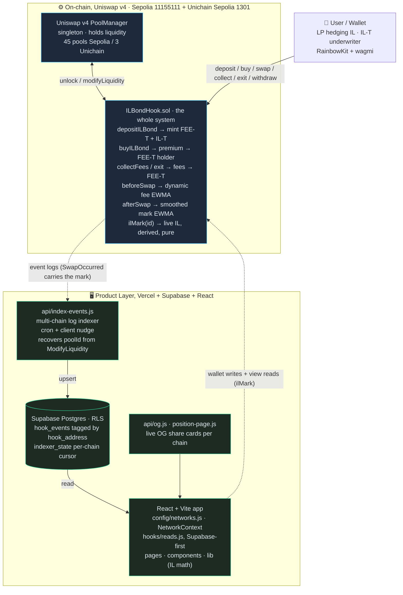
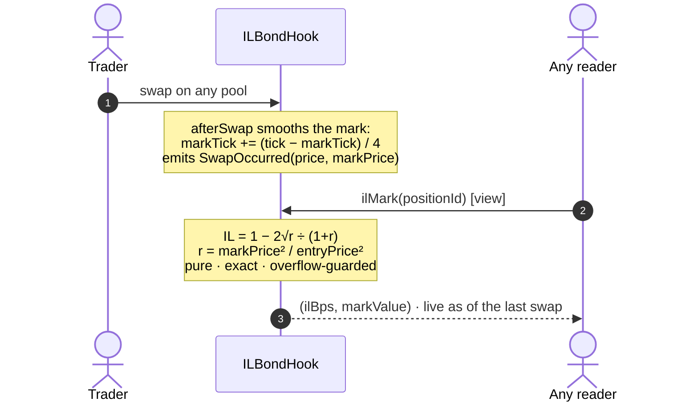

# schizō: Hedge impermanent loss. Keep the yield.

**A single Uniswap v4 hook that splits every LP position into a hedged yield leg (FEE-T) and a risk leg (IL-T), with the risk leg marked to market by the hook itself on every swap. No oracle, no keeper, no off-chain anything.**

Live app: https://schizo-il-bond.vercel.app · Built for UHI9 (Theme: Impermanent Loss) · Uniswap v4

> **This repository is a fork of the Uniswap [`v4-template`](https://github.com/uniswapfoundation/v4-template)**, the official scaffolding for building v4 hooks. We used it for the PoolManager / PositionManager wiring, `HookMiner` salt-mining, and the Foundry harness, and built the entire ILBondHook system on top of it.

> **UHI9 result:** schizō won a prize at the UHI9 Hookathon. The judge scored Original Idea and Unique Execution at 4.5/5 each, and wrote that marking the risk leg to market on every swap turns the IL-T into "a live, tradeable bond instead of a number you only learn at exit." The one thing they asked us to confirm, that the on-chain mark can't be skewed by a same-transaction price move, is now enforced in-protocol. See "The mark is manipulation-resistant" below.

---

## 1. About the project

### What we do

A Uniswap LP position is really two unrelated exposures stapled together:

- **Fee income**: steady, grows with trading volume.
- **Impermanent loss**: the bill you pay whenever price moves. It is the single biggest reason capital leaves AMMs.

These belong to different owners. A DAO treasury wants the yield and would pay to make the price risk disappear. A market-making desk that is long volatility elsewhere would happily absorb that same risk at the right price, because it offsets their book. Uniswap forces both of them to hold the identical bundle, so neither shows up.

**schizō unbundles the position at deposit time into two transferable claims on the same liquidity:**

| Leg | What it holds | Who holds it |
|-----|---------------|--------------|
| **FEE-T** | swap fees **+** an upfront premium · **zero price risk** | the hedged LP: treasuries, desks, passive capital |
| **IL-T** | the LP principal and its impermanent-loss outcome | the underwriter: desks hedging long-vol books, funds earning risk premium |

Hold both legs and you are a normal LP. Sell **IL-T** and you have hedged your impermanent loss: you keep the fees and the premium, and the price risk belongs to someone who priced it and wanted it. This is the same move fixed-income markets made when they stripped bonds into principal and coupon, and the same move Pendle made for yield. Nobody had made it for impermanent loss. **IL stops being a tax and becomes a hedge you can buy and a premium you can earn.**

### Why it's unique

- **Everyone else *reduces* IL. We let you *hedge* it.** Dynamic-fee hooks, rebalancing, insurance pools and LVR auctions all leave the LP holding the risk and try to soften it. schizō moves the risk, whole, to a counterparty who wants it, and pays the LP for the transfer. That is what a real hedge is.
- **Not a derivative. A slice of the position itself.** Options-on-LP write a contract next to a position. IL-T *is* the position's risk leg, settled from the real underlying at exit. There is no oracle to trust and no synthetic to unwind.
- **Fully bilateral, no capital pool.** Insurance hooks need a float to pay claims. schizō needs nothing but a counterparty and a premium. The books always balance because the two legs are two halves of one real position.
- **The protocol prices the hedge itself.** Pass an ask of zero and `quotePremium` derives a fair premium on-chain from the pool's live realized volatility, the range width, and the position's notional. No hand-typed numbers, no off-chain vol oracle.
- **The risk leg keeps itself honest.** IL is a function of price, and the hook sees every price change, because every price change *is* a swap through it. So the hook maintains a smoothed marking price per pool in `afterSwap` (two storage writes) and derives each position's IL from it at read time with one pure function. Nothing to run, nothing to fund, nothing to trust. The entire marking system is ~40 lines inside the hook.
- **The mark is manipulation-resistant.** Two layers, both structural: the marking price is an EWMA-smoothed tick, so a single swap moves the mark only a quarter of the way to its own price. And the mark is never *stored* per position, it is derived on demand, so there is no stale value to poison and no settlement transaction to front-run. An attacker has to hold a skewed price across many swaps and pay arbitrageurs the whole way. This directly answers the one open question from the UHI9 judges.
- **FEE-T is a real claim on real fees.** At exit the hook splits `feesAccrued` from principal: swap fees route to the FEE-T holder, the underlying routes to the IL-T holder. `collectFees` harvests accrued fees to the FEE-T holder any time, without closing the position.
- **Genuinely dynamic fees.** Each pool charges `0.30% + f(realized volatility)`, capped at 3%, driven by an on-chain EWMA of tick movement. Verified climbing under load and decaying when calm, so LPs get paid most exactly when IL risk is highest.

### Where marking lives, and why

The hackathon build computed marks in an external event-driven contract on a second network. It worked, but it carried three liveness assumptions: a callback service, a funded gas balance, and a cross-chain relay. v5 deletes all three. The insight is that a Uniswap v4 hook already *is* the event listener: `afterSwap` fires on exactly the events the external engine subscribed to. So the smoothing EWMA moved into the hook, the IL formula became a `public pure` function (`computeILMark`), and per-position marks became a lazy view (`ilMark`) computed from entry price vs the pool's smoothed mark. Strictly fewer trust assumptions, always-fresh marks, zero extra gas on the swap path, and the whole system is one auditable contract.

---

## 2. Architecture

Two layers: **settlement + brains** (one Uniswap v4 hook, deployed independently per chain) and **product** (indexer + frontend). Everything in the app resolves by the connected wallet's chain.



**The hot path stays cheap.** `afterSwap` updates two EWMAs (volatility for the dynamic fee, smoothed tick for the mark) and emits one event. The expensive part, the square-root IL formula, never runs on the swap path at all: it runs at *read* time, in a `view` call that costs traders nothing.

**Marks rebuild from the event log alone.** `SwapOccurred` carries both the spot price and the smoothed marking price, so any indexer can reconstruct every position's full IL history trustlessly from swap events, no archival state reads, no privileged data source.

**The frontend reads backend-first.** Public RPCs cap `eth_getLogs` to ~9,500 blocks (hours of history). The Supabase indexer ingests the *full* hook-event history per chain, so price charts, IL marks, activity feeds, leaderboards and pool trends are complete and fast; on-chain log reads are only a fallback.

### The marking loop



**Exit and settle (separate user action).** A current leg holder calls `exitPosition`: liquidity is removed and the proceeds split exactly. Accrued swap fees are credited to the **FEE-T holder**; the underlying principal is credited to the **IL-T holder**, whose composition *is* the impermanent-loss outcome. Each party then `withdraw`s per token. The FEE-T holder can also harvest fees any time with `collectFees`, without closing anything. No timer anywhere; the mark updates exactly when price does.

---

## 3. What is where, and how to run it

### Repository layout

```
src/
  ILBondHook.sol          # the entire protocol: one v4 hook, self-marking
  MockERC20.sol           # mintable test token (in-app faucet)
test/                     # 72 Foundry tests: unit, fuzz, invariant
  ILBondHook.t.sol        # lifecycle, fee routing, smoothed mark, auto-quote, native pools
  ILBondHookEdge.t.sol    # refunds, premium+fee routing to current holder, exit auth, events
  ILMarkMath.t.sol        # IL math fuzzed over the full sqrt-price range
  ILBondHookInvariant.t.sol # solvency / active-set / fee-bound / mark-bound invariants
script/
  25_FreshDeploy.s.sol        # Sepolia: hook + 45 pools, seeded
  30_UnichainDeploy.s.sol     # Unichain: hook + 3 mock tokens + pools + 2 positions
  31_UnichainSwaps.s.sol      # Unichain: price-moving swaps
frontend/                 # React + Vite app
  src/config/networks.js      # per-chain deployment registry (the source of truth)
  src/hooks/reads.js          # all contract/data reads (Supabase-first, chain fallback)
  src/lib/                    # IL math, liquidity, quoting, formatting, supabase client
  src/pages/ , src/components/  # the UI
  api/index-events.js         # multi-chain Supabase event indexer (cron + client nudge)
  api/og.js , api/position-page.js  # live share cards per chain
  supabase/schema.sql         # the hook_events + indexer_state tables (run once)
  vercel.json                 # routes + the daily indexer cron
ILBOND_PITCH.md           # the pitch
ILBOND_REPORT.md          # full technical report
```


### Prerequisites

- [Foundry](https://book.getfoundry.sh/) (`forge`, `cast`) · Node 18+ · npm
- A funded testnet key for deploying/swapping (Sepolia ETH, Unichain Sepolia ETH)

### Contracts: build & test

```bash
forge install
forge build
forge test            # 72 passing: unit + fuzz + invariant
```

### Frontend: run locally

```bash
cd frontend
npm install
npm run dev           # Vite dev server; reads on-chain directly
```

The app works against the **live** deployments out of the box. The Supabase indexer and OG cards run as Vercel functions. To exercise them locally use `vercel dev`, or just deploy. Environment variables (frontend reads `VITE_`-prefixed; the indexer reads server-only keys):

```
VITE_SUPABASE_URL=...              # public, read-only client
VITE_SUPABASE_PUBLISHABLE_KEY=...
SUPABASE_URL=...                   # server-side (indexer)
SUPABASE_SERVICE_ROLE_KEY=...      # server-side ONLY, never shipped to the client
VITE_SEPOLIA_RPC= / VITE_UNICHAIN_RPC= / VITE_LOG_RPC=   # optional RPC overrides
```

Backend setup: run `frontend/supabase/schema.sql` once in the Supabase SQL editor (creates `hook_events` + `indexer_state` with RLS: public read, indexer writes with the service-role key). The indexer is multi-chain: each chain has its own entry in `api/index-events.js NETWORKS` and its own resume cursor, and rows isolate by `hook_address`.

### Live deployments

| | Ethereum Sepolia (11155111) | Unichain Sepolia (1301) |
|---|---|---|
| ILBondHook | `0x57696AB5077Aa634c13682C3d3E84287935290c0` | `0x20487A756FececfF800d15EC76C78e0487A2D0c0` |
| PoolManager | `0xE03A1074c86CFeDd5C142C4F04F1a1536e203543` | `0x00B036B58a818B1BC34d502D3fE730Db729e62AC` |
| Pools | 45 pairs (10 tokens) | 3 pairs (mWETH/mWBTC/mUSDC) |

### Deploy your own

```bash
# Sepolia (45 pools, seeded)
forge script script/25_FreshDeploy.s.sol --rpc-url <SEPOLIA_RPC> --private-key $KEY --broadcast

# Unichain Sepolia (3 pools + 2 positions)
forge script script/30_UnichainDeploy.s.sol --rpc-url https://sepolia.unichain.org \
  --private-key $KEY --broadcast --slow
```

That's the whole deployment. One contract per chain; the hook needs no funding, no registration, and no companion services.

---

## 4. Beta status and roadmap

Everything the pitch promises is now real in the contracts: the split, the premium, the per-swap mark, fee routing to the yield leg, and on-chain premium quoting. What we are explicit about for beta users:

- **Testnet only.** Mock tokens, test ETH. Do not bring real money yet.
- **The live mark is a price, not a settlement engine.** Exit settles from the real underlying (which is the honest ground truth); the per-swap mark is the live quote you trade the legs against. Making the mark itself move collateral between the legs is the next protocol version.
- **The premium quote is a first-order model.** `quotePremium` prices the hedge from realized volatility, range width and notional, clamped to sane bounds. It is deliberately conservative; a full term-structure model comes later.

Next up:

- **Streaming premiums.** Today the premium is a lump sum at purchase. A funding-style stream from the IL-T underwriter to the FEE-T holder (or the reverse, depending on the mark) turns the hedge into a continuously re-priced position and pairs naturally with the `collectFees` plumbing that already exists.
- **Binding mark-to-market.** Let the hook's derived mark move margin between the two legs before exit, so the hedge pays out continuously instead of at close.
- **Tranched risk.** A senior IL-T that eats the first 5% of IL and a junior that eats the rest: two risk-adjusted premiums from one position.
- **Cross-pool netting.** The hook already marks every pool it runs; one IL-T could hedge a book's *net* exposure across correlated pools.

---

*Uniswap v4 for settlement. The hook for the brains. Testnet only. Not financial advice.*
